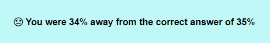
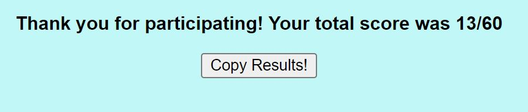
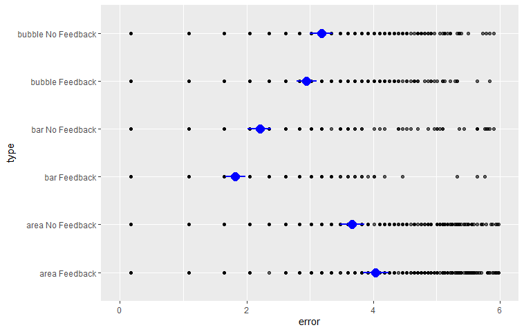
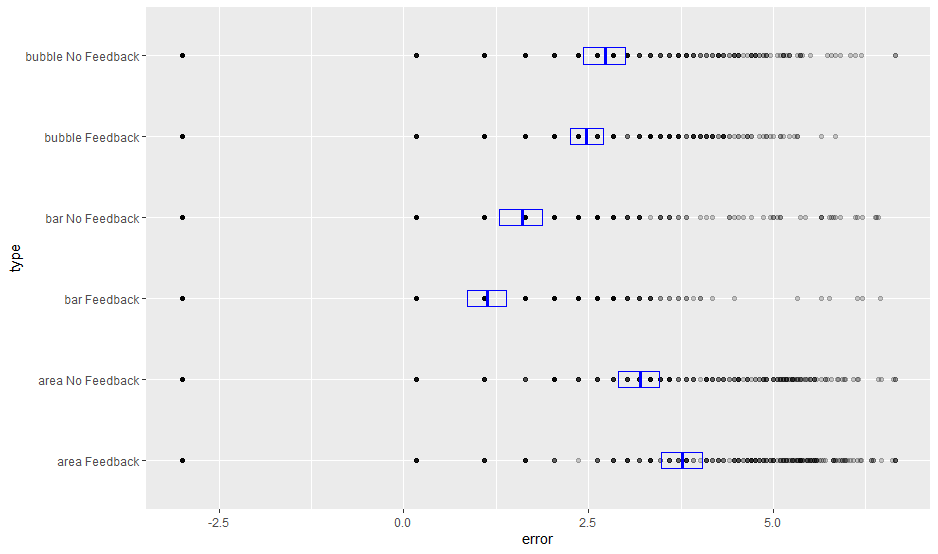

Assignment 3 - Replicating a Classic Experiment  
===

Working link to the experiment hosted:
* https://meggitt.dev/ 
* http://jcybul.github.io/a3-experiment/public/index.html

For our experiment, we wanted to test how immediate feedback would affect the user's response. We created two user groups, one serving as the control with no feedback, and one with immediate feedback after each response. We were interested to see if the immediate feedback would have a positive or negative effect on the user’s guesses. 

The three data visualization types that were selected to experiment with were:

- Bar Chart
- Stacked Area Chart
- Bubble Chart

The bar chart was used in Cleveland and McGill's original experiment and proved to have an error on the smaller side, so it was included in this experiment as well. The stacked area chart was a more interesting way of comparing areas that were stacked on top of each other than a stacked bar chart. We also wanted to include a slightly more difficult chart to analyze and decided to include the bubble chart. Based on the results from Cleveland and McGill’s experiment and others similar to theirs, this kind of graph resulted in higher errors. 

Screenshots
---

This is the first page that users are greeted with. At the top it displays the title of the experiment, which was kept simple, and the question, which persisted on each page. Beneath the instructions is where the svg is located, which displays the different graph types. The first three graphs, one of each type, have instructions displayed in order to help explain how they should be read. They also provide the correct answer so the user can get a better understanding of how they should read the graph. There is an input section for the guess, which can be submitted by clicking the “Enter” key or the “Enter” button. The user is also informed about how many total questions there are and which one they are currently on. The bar graph is shown first. 

This is what the stacked area graph looked like. We selected only two area sections to make the comparison easier, and instructed the user to compare the areas at line “X”. The smaller area was always the lighter gray color. 

This is what the instruction page for the bubble graph looks like. There were only two bubbles displayed and the user was given the correct answer. The bubbles are indicated by color where the lighter gray was also the smaller of the two. 

This is an example of a random bar graph in which a user was supposed to compare B with A. 

This is an example of a random stacked area chart at which the user was supposed to compare the lighter gray section with the darker gray. 

This is an example of a random bubble chart where the user was supposed to compare the smaller bubble with the bigger one.

Above are examples of the feedback messages that would be displayed for the second user group. One indicating if the user answered correctly and within 10% of the correct answer and one indicating if the answer was incorrect and farther than 10% of the correct answer. 

This is the final message that the user is greeted with at the end of the experiment. It provides the final score of correct answers that the user got. Both user groups are able to see how well they performed. They are also able to click the "Copy Results!" button in order to copy a message including their score and a link to the experiment to their clipboard. The message copied for this experiment was "I guessed 13/60 correct! Link: https://meggitt.dev." This allows user to easy share their scores with friends and encourage others to participate. 

Results
---
As mentioned, before we hypothesized that providing feedback to the user would have a positive effect on their overall results, compared to no feedback at all. From the data we collected we can observe that for two of the three graphs our hypothesis was correct:
- **Bar Chart**: when the users had feedback on what their answers was, they had an error value of 1.12 (log based to the absolute difference) from the right answer, compared to 1.60 when no feedback was provided. 
- **Bubble Chart**: with feedback provided the user had an error value of 2.47, and with no feedback the error value was 2.73
- **Area Chart**: the area chart was the only one that had better results when no feedback was provided 3.1 compared to 3.76 when feedback was provided, we believe that this happened because the area graph is somewhat confusing on its own, so providing feedback cause the user to be more confused and provide an incorrect answer. 

We have created the 95% confidence interval for mean bootstrap based on bar type and feedback, to visually analyze what the difference of having feedback and not having feedback	was: 

Technical Achievements
---

Design Achievements
---
In terms of design, we kept everything very simple for this project. The graphs were displayed in black and each area that we wanted the user to look at was colored in different shades of gray. To keep things consistent, we colored the smaller area with a light gray and the larger area with a darker gray. 

We also made the background color a light blue to make the experiment slightly more visually appealing. We were worried that not many users would be interested in completing all 60 questions in the experiment if it was more simple with a white background and only black graphs. As long as the colors stayed consistent throughout the whole experiment, they should not have affected how user’s responded. Only the feedback messages should have had an effect. 

