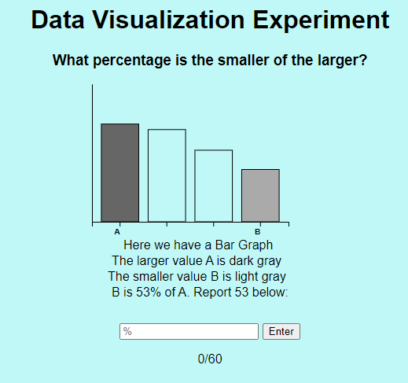
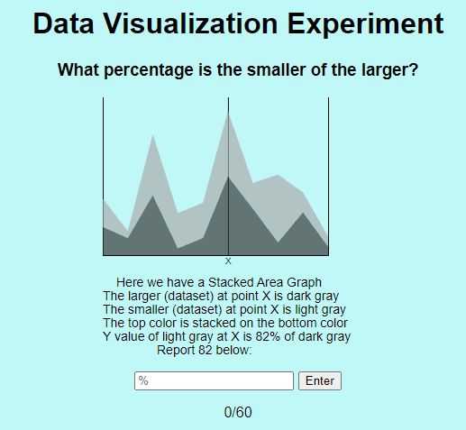
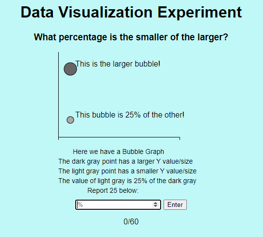
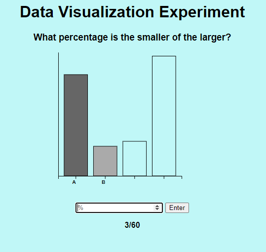
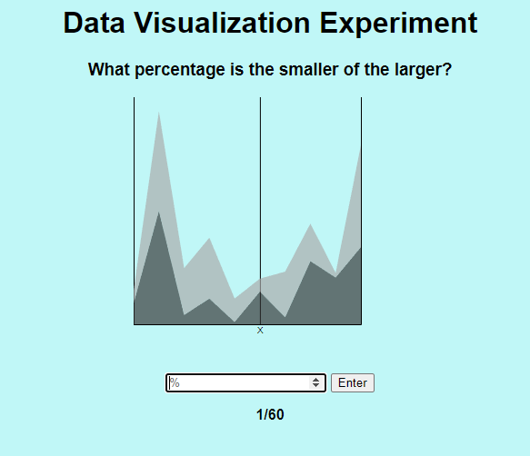
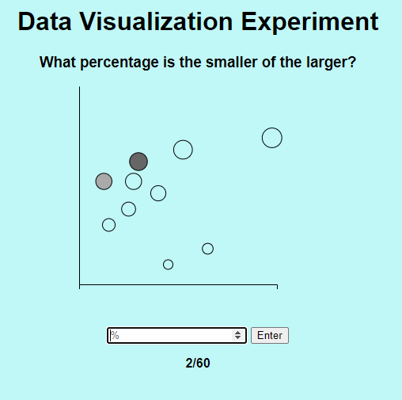
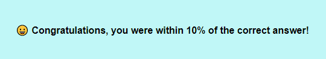

Assignment 3 - Replicating a Classic Experiment  
===
README
Working link to the experiment hosted on gh-pages or some other site.
* https://meggitt.dev/ 
* http://jcybul.github.io/a3-experiment/public/index.html

Concise description and screenshot of your experiment.
For our experiment, we wanted to test how immediate feedback would affect the user's response. We created two user groups, one serving as the control with no feedback, and one with immediate feedback after each response. We were interested to see if the immediate feedback would have a positive or negative effect on the user’s guesses. 

The three data visualization types that were selected to experiment with were:

  *Bar Chart
  *Stacked Area Chart
  *Bubble Chart

The bar chart was used in Cleveland and McGill's original experiment and proved to have an error on the smaller side, so it was included in this experiment as well. The stacked area chart was a more interesting way of comparing areas that were stacked on top of each other than a stacked bar chart. We also wanted to include a slightly more difficult chart to analyze and decided to include the bubble chart. Based on the results from Cleveland and McGill’s experiment and others similar to theirs, this kind of graph resulted in higher errors. 

This is the first page that users are greeted with. At the top it displays the title of the experiment, which was kept simple, and the question, which persisted on each page. Beneath the instructions is where the svg is located, which displays the different graph types. The first three graphs, one of each type, have instructions displayed in order to help explain how they should be read. They also provide the correct answer so the user can get a better understanding of how they should read the graph. There is an input section for the guess, which can be submitted by clicking the “Enter” key or the “Enter” button. The user is also informed about how many total questions there are and which one they are currently on. The bar graph is shown first. 

This is what the stacked area graph looked like. We selected only two area sections to make the comparison easier, and instructed the user to compare the areas at line “X”. The smaller area was always the lighter gray color. 

This is what the instruction page for the bubble graph looks like. There were only two bubbles displayed and the user was given the correct answer. The bubbles are indicated by color where the lighter gray was also the smaller of the two. 

This is an example of a random bar graph in which a user was supposed to compare B with A. 

This is an example of a random stacked area chart at which the user was supposed to compare the lighter gray section with the darker gray. 

This is an example of a random bubble chart where the user was supposed to compare the smaller bubble with the bigger one.

Description of the technical achievements you attempted with this project.
Description of the design achievements you attempted with this project.

